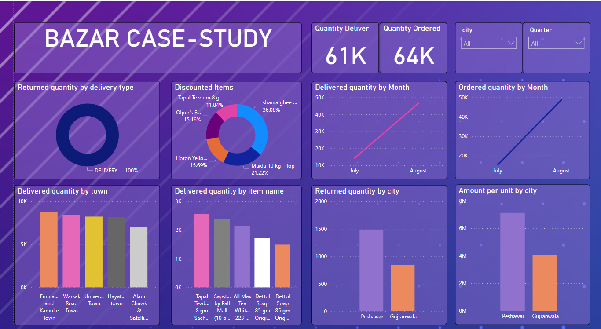

# Bazar-Casestudy-in-Power-Bi

This repository contains a Power BI dashboard developed as a case study for Bazar. The dashboard provides key insights into order management and delivery performance, focusing on the following critical metrics:

* **Number of Orders:** Total count of orders placed.
* **Orders Delivered:** The number of orders successfully delivered to customers.
* **Quantity Orders:** The total quantity of items ordered.
* **Quantity Delivered:** The total quantity of items successfully delivered.

The dashboard aims to provide a comprehensive view of the operational efficiency and success rates within the Bazar order fulfillment process.

